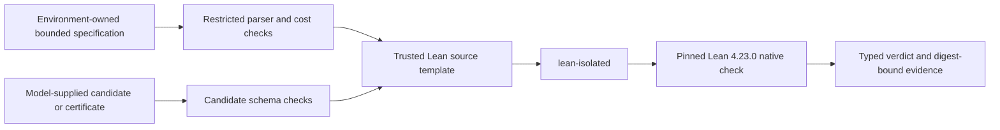

# Building a Lean-Backed Verifier for Bounded Mathematical Answers

> MathCheck Engine turns restricted integer specifications and candidate
> answers into generated Lean 4 programs, evaluates them with `native_decide`
> inside a fail-closed sandbox, and reports exactly what the resulting verdict
> establishes.

An integer answer looks like the simplest possible thing to verify. If a model
says the answer is 33, compare it with 33 and award a point. That is how many
mathematical benchmarks work, and often it is entirely reasonable.

But the apparent simplicity hides the important question: where did the second
33—the one in the answer key—come from, and what exactly does equality with it
establish?

A handwritten key may contain a transcription error. A Python reference
function may implement a subtly different interpretation of the problem. A
finite test suite may miss the one input on which a proposed program breaks. A
checker process may time out and accidentally turn an infrastructure failure
into the label “wrong mathematics.” If the task asks for all satisfying pairs,
a verifier that checks only the submitted pairs may reward a single convenient
witness while missing the rest.

MathCheck Engine grew out of taking those distinctions seriously. Its current
goal is deliberately narrower than “formalize mathematics” or “solve olympiad
problems.” It checks complete, explicitly bounded computational contracts. The
caller supplies a restricted specification and a candidate integer—or, for one
family, a complete finite certificate. The engine constructs the Lean program,
runs a pinned Lean 4.23.0 toolchain under a fail-closed Linux isolation wrapper,
and returns a verdict whose scope and failure mode are explicit.

That narrowness is not an apology. It is what makes the result understandable.

## Start with the claim, not the answer

Consider this question:

> How many integers `x` with `1 <= x < 100` are divisible by 3?

An answer key stores `33`. A complete bounded specification stores something
closer to this:

```python
ProblemSpec(
    kind="count",
    expression="x % 3 == 0",
    start=1,
    stop=100,
)
```

The candidate is still just `33`. The important difference is that the trusted
object is no longer the candidate itself. It is the rule and its domain. The
checker computes the entire finite domain described by the rule and asks
whether the submitted integer agrees.

This separation gives us useful vocabulary:

- An **answer key** stores the result expected from the model.
- A **specification** stores the mathematical computation or relation to be
  checked.
- A **candidate** is the scalar result supplied by the model.
- A **witness** is one object showing that an existential condition holds.
- A **complete certificate** contains enough structured data to establish the
  whole finite result required by a contract.
- A **proof** is a term accepted for a stated proposition in a proof system.

These objects are not interchangeable. A count is not a proof of the predicate.
A valid pair is not a complete enumeration. A complete enumeration inside a
finite rectangle says nothing automatically about points outside it. A Lean
program can check the wrong formalization perfectly.

MathCheck Engine tries to preserve those differences all the way into its API
and evidence.

## The path from a specification to a verdict

The main pipeline is small enough to describe end to end:



The specification and candidate cross different trust boundaries. Expressions
are parsed with Python's syntax parser, but only a small allowlist is translated:
integer literals, declared variables, addition, subtraction, multiplication,
literal nonnegative powers, division or modulo by a positive literal,
comparisons, and Boolean conjunction, disjunction, and negation. Attribute
access, function calls, imports, arbitrary names, floating-point values, and
general Python execution are not part of this language.

The parser also imposes mechanical limits. An expression is at most 2,000
characters and 100 syntax nodes. Integer literals are bounded. Powers use a
literal exponent from 0 through 16 and cannot be nested. Division and modulo
require a positive literal divisor. These rules are not a statement about what
mathematics is interesting; they are a statement about the surface we have
actually audited and costed.

The model does not provide the Lean theorem or the expression being checked.
Trusted code combines the frozen specification and the separately parsed
candidate into a source template. That design matters. Letting a model submit
its own proposition would let it prove an easier statement than the environment
intended.

The resulting program reduces the check to a concrete Boolean proposition and
uses `native_decide`. A small surrounding theorem asserts that the computed
result is the expected success marker. If Lean accepts, the encoded proposition
held under the executable semantics used by that program.

## Three interfaces with different meanings

The repository contains more machinery than the bounded specification API, and
it is important not to let their meanings blur together.

`verify_answer` and `verify_pair_certificate` are the preferred structured
interfaces. They receive typed objects, enforce the bounded language and cost
limits, and compile the authoritative source from trusted templates. In this
path, model output is a candidate or certificate, not executable Lean code.

`LeanCheckerRunner.run_source` is a lower-level interface. It can check a Lean
source artifact after the repository's sanitizer accepts it. This remains
useful for controlled tooling and for the historical finite-sequence work, but
its sanitizer is lexical—it is not a Lean parser, a proof of harmlessness, or
an operating-system sandbox. The runner's successful result means that the
submitted source passed the configured checks and Lean. It does not mean that
the source corresponds to an intended natural-language problem.

The repository also contains symbolic proposal tools: interpolation,
Berlekamp–Massey recurrence discovery, holonomic fitting, trace consensus, and
Gröbner-based geometry routines. These tools can suggest a formula or help
identify structure. They are not final verification authority. A recurrence
that matches finitely many observations may fail at the next index. A symbolic
geometry computation may omit a non-degeneracy assumption. Proposal and
checking are deliberately different stages.

This separation helps answer a common question: is MathCheck Engine a solver?
Not in its bounded verification role. It may contain utilities that discover
candidates, but the trusted result begins only when an independently stated
contract and a submitted candidate meet at the checking boundary. A solver's
confidence score, trace agreement, or successful exit code cannot substitute
for that boundary.

## The contracts that exist today

MathCheck Engine 0.3.2 exposes five structured bounded families. Every interval
is half-open, so `[start, stop)` includes `start` and excludes `stop`.

### Exact evaluation

An `evaluate` specification contains a closed integer expression and no bound
variable. The candidate must equal its exact integer value.

```python
ProblemSpec("evaluate", "(7**5 - 3)//2 % 97")
```

The checked answer for this example is 60. Evaluation is useful for explicit
arithmetic but does not turn approximate numerical analysis into an exact
contract. The current candidate is also a nonnegative integer, so a problem
whose true output is negative or rational needs a different future contract.

### Bounded sums

A `sum` specification folds an integer expression over every `x` in the stated
interval. Empty intervals are allowed and have sum zero.

```python
ProblemSpec("sum", "x*x - 2*x", 2, 9)
```

The candidate is checked against the exact fold, not against a few sampled
values and not against a floating-point approximation.

### Bounded counts

A `count` specification evaluates a predicate at every integer in the interval
and compares the number of satisfying values with the candidate.

```python
ProblemSpec("count", "x%3 == 0 and x%5 != 0", 1, 31)
```

This is a natural fit for finite number-theory searches, modular conditions,
and small combinatorial encodings.

### Bounded minima

A `minimum` specification does more than check feasibility. The candidate must
be inside the interval, satisfy the predicate, and have no smaller satisfying
value in the domain.

```python
ProblemSpec("minimum", "x%7 == 3 and x%5 == 2", 0, 100)
```

Here 17 succeeds and 52 fails even though 52 satisfies the same congruences.
This is the difference between checking a witness and checking optimality.

### Complete bounded pair relations

`PairCountSpec` covers predicates over two nonnegative integer variables inside
a finite rectangle. The model supplies both a count and the entire satisfying
relation as a sorted, duplicate-free list.

```python
spec = PairCountSpec(
    "x < y and x+y == 4",
    x_start=0,
    x_stop=5,
    y_start=0,
    y_stop=5,
)

certificate = PairCertificate(
    pairs=((0, 4), (1, 3)),
    answer=2,
)
```

Lean independently constructs the full satisfying relation in lexicographic
domain order. Acceptance requires exact list equality and matching cardinality.
The following submissions all fail for different reasons:

- `((0, 4),)` contains a valid witness but omits `(1, 3)`;
- `((0, 4), (1, 3))` with count 1 has the right relation and wrong cardinality;
- a duplicated pair violates canonical certificate structure;
- an out-of-bounds or predicate-violating pair cannot match the computed
  relation.

Large certificates are passed to Lean as bounded decimal data and decoded
there. This avoids elaborating a deeply nested list term while retaining exact
ordered equality. It is a representation optimization, not a probabilistic
fingerprint or sampled check.

## Bounds are part of the theorem

The scalar domain contains at most 10,000 values, with nonnegative endpoints no
larger than 1,000,000. A pair specification may expose axes up to that endpoint,
but their Cartesian product is limited to 10,000 pairs. Scalar answers are
nonnegative integers below `10**1000`; pair counts lie between 0 and 10,000.

Those limits serve two purposes. First, they make the logical scope visible. A
successful count over `[1, 100)` does not imply a density theorem over all
natural numbers. Second, they make denial-of-service and accidental
combinatorial explosion easier to reason about before invoking Lean.

This is what “bounded” means in the project name and claims: the complete
declared finite domain is checked. It does not mean that every mathematical
problem with an integer answer can be faithfully reduced to the current
grammar.

The familiar competition categories—algebra, combinatorics, number theory, and
geometry—are subject labels, not certificate formats. Number theory and small
finite combinatorics fit best today. Some integer-valued algebra reduces cleanly
to evaluation, sums, counts, or minima. Geometry fits only when a trusted source
has already reduced it to a bounded integer-coordinate search. Exact rational
coordinates, algebraic numbers, incidence assumptions, graph certificates,
permutations, polynomial identities, and unbounded proofs need other contracts.

## What Lean contributes

It is tempting to summarize the project as “Lean verifies the answer,” but that
sentence is too compressed to be useful.

Lean contributes a precise typed language in which the checker computation is
expressed. The generated proposition is visible and reproducible. The same
system that elaborates the program also decides the finite claim. This reduces
the chance that a Python reward function and a claimed mathematical contract
quietly diverge.

Lean also makes the acceptance boundary crisp: the generated file either
elaborates and its decision procedure establishes the proposition, or it does
not.

But `native_decide` is not kernel-only reduction. It relies on Lean's compiler
and native runtime in addition to its logical foundation. MathCheck Engine
therefore reports its trust model as `lean_native_compiler_and_runtime`. The
historical Python distribution name, `lean-kernel-verifier`, remains for 0.x
compatibility; it should not be read as a claim that native execution trusts
only the kernel. Lean's own
[reference on proof validation](https://lean-lang.org/doc/reference/latest/ValidatingProofs/)
describes this distinction in more detail.

Lean also cannot rescue a bad specification. If a word problem was translated
incorrectly, the engine may faithfully check the incorrect translation. A
digest can establish exactly which specification was checked, but not whether
that specification captured the author's intention. Semantic provenance and
review remain upstream responsibilities.

Finally, a compiler verdict is not a security sandbox. Running a model-produced
or generated program safely is a separate systems problem.

## Treating verification as untrusted execution

Temporary directories and subprocess timeouts are useful hygiene, but they are
not isolation. A process can still see the host filesystem and environment,
open network connections, fork children, or consume resources outside a simple
wall-clock limit.

MathCheck Engine includes an opt-in Linux entry point called `lean-isolated`.
It requires a standalone Lean 4.23.0 distribution and refuses to fall back to a
host `lean` executable. Under the wrapper:

- bubblewrap creates separate filesystem, network, process, and other
  namespaces;
- capabilities are dropped and the environment is cleared;
- the Lean distribution and required system libraries are mounted read-only;
- the source is copied into a new writable work directory;
- the home directory is replaced by a private temporary directory;
- `prlimit` applies per-process address-space, CPU-time, output-file,
  file-descriptor, and core-dump limits;
- source size, diagnostic output, version-probe time, and compilation wall time
  are bounded.

The current concrete ceilings include a 2 GiB address space, 120 CPU seconds,
150 seconds of compilation wall time, a 16 MiB output-file limit, 128 file
descriptors, a 2 MiB source limit, and 256 KiB of returned diagnostics.

If bubblewrap, `prlimit`, namespace access, the configured toolchain, or the
exact Lean version is unavailable, isolation fails closed. That choice is easy
to miss but essential: silently dropping to direct execution would turn a
security configuration error into apparent availability.

The wrapper is still not an audited multi-tenant service. Its resource limits
are per process, not aggregate cgroups. The configured toolchain, dynamic
libraries, kernel, bubblewrap, and host policy remain trusted. A deployment also
needs a dedicated worker identity, aggregate process and memory limits, bounded
scratch storage, cleanup, monitoring, and its own security review.

`toolchain_identity` records the SHA-256 of the Lean executable. That is useful
evidence, but it is not a supply-chain attestation for every compiler library
and operating-system component.

## A failed check is not always wrong mathematics

A reward system often wants one bit, but operators need more than one bit to
understand it. MathCheck Engine separates these outcomes:

| Status | Meaning |
| --- | --- |
| `checked_success` | The configured checker ran and accepted the encoded claim |
| `mathematical_rejection` | A well-formed candidate reached Lean and the encoded claim failed |
| `invalid_input` | The request or candidate violated its structural contract |
| `unsupported_task` | The requested operation is outside the implemented contract registry |
| `operational_error` | The checker timed out, could not start, had a version mismatch, or suffered a backend failure |

The structured scalar and pair results bind the specification digest to the
candidate, compiler result, status, scope, and trust statement. Pair results
also bind a certificate digest. These fields make it possible to distinguish
“the model proposed the wrong count” from “the Lean toolchain was missing.”

Both may produce zero reward in a downstream environment. They should not
produce the same scientific label. Otherwise an infrastructure regression can
look like a collapse in mathematical ability, or a broken checker can silently
generate false negative training data.

## Adversarial tests matter more than happy-path demos

The most informative tests are rarely “2 + 2 equals 4.” The release suite asks
whether nearby but wrong candidates fail, whether a nonminimal satisfying value
is rejected, whether an incomplete pair list can pass, whether duplicate JSON
keys or pseudo-integers such as `True` cross the boundary, and whether a missing
isolation dependency ever triggers direct execution.

Several implementation improvements came directly from negative controls. A
multiline Lean declaration once exposed a template indentation bug that
text-only tests missed. Large complete pair lists initially caused timeouts
because of their syntax representation; exact in-Lean decimal decoding fixed
the representation without weakening the proposition. Lexical sanitizer tests
found declaration forms that a line-prefix rule could miss. Live namespace
probes verify that a host marker file and environment variable are hidden and
that the child network namespace differs from the host.

The 0.3.2 release passed 71 tests and 42 generated subtests with real Lean
enabled. Its complete release gate then ran twice. Each run:

1. checked the exact versions of the release tools;
2. verified the read-only toolchain and Lean executable digest;
3. built all versioned project wheels with a fixed source-date epoch;
4. installed them in a disposable environment outside the source trees;
5. ran `pip check` and asserted installed versions;
6. accepted a known-correct bounded answer through isolated Lean;
7. rejected a known-wrong answer through the same path.

The two builds produced the same Engine wheel byte for byte. The published
wheel SHA-256 is
`61f5d485d59b77270df4134c0dd332afe9fbd7b7596baa85400341b85259bd4d`.
The tested Lean executable SHA-256 is
`cbf5fd536e142ef1beaccf33f788fd8a7f3f29fb214e75c11319a8d8677b4b2b`.
The release manifest records the remaining build inputs and artifacts.

This is strong regression evidence for the declared path. It is not a proof
that no implementation defect exists.

## Evidence needs a chain of custody

A bare message saying “Lean passed” is difficult to audit later. The same source
can behave differently under a changed compiler, altered flags, or a different
dependency graph. A result can also be accidentally associated with the wrong
specification after a batch job retries or reorders work.

For that reason, the engine treats identity as part of verification evidence.
A specification digest is computed from canonical serialized fields. Pair
results add a digest of the complete certificate. Runner results preserve the
backend mode, return code, timeout flag, diagnostics, and duration. Release
validation binds the Python distributions to the tested Lean executable digest
and locked build-tool versions.

This is not full reproducible-computing nirvana. Hashing the Lean executable
does not hash every shared library, the kernel, or the CPU. A specification
digest does not attest to the correctness of its author. It does, however,
prevent a much simpler failure: looking at a verdict while being unable to say
which exact claim and artifact produced it.

The release facts are collected in
[`RELEASE_EVIDENCE_0.3.2.md`](RELEASE_EVIDENCE_0.3.2.md), while
[`AUDIT.md`](AUDIT.md) preserves defects found during development and
[`CAPABILITIES.md`](CAPABILITIES.md) is the compact supported-interface
contract. Keeping those records separate from aspirational future work makes it
harder for a roadmap item to become an accidental present-tense claim.

## Reproducing a check

MathCheck Engine 0.3.2 supports Python 3.11 through 3.13. A basic source install
and non-live test run looks like this:

```bash
git clone https://github.com/stanleyngugi/mathcheck-engine.git
cd mathcheck-engine
git checkout v0.3.2
python3.12 -m venv .venv
. .venv/bin/activate
python -m pip install -e '.[dev]'
python -m pytest tests -q
```

Lean is installed separately. For the raw runner's live tests, point `LEAN_BIN`
at a compatible executable:

```bash
LEAN_BIN=/absolute/path/to/lean python -m pytest tests/test_live_lean.py -q
```

For model-facing or otherwise untrusted execution, use Linux, install
bubblewrap, configure a standalone Lean 4.23.0 distribution, and use the
isolation entry point:

```bash
export LKV_SANDBOX_TOOLCHAIN=/absolute/path/to/lean-4.23.0-linux
lean-isolated --version
```

A minimal bounded count check is:

```python
from lean_kernel_verifier.runner.checker_runner import (
    CheckerRunConfig,
    LeanCheckerRunner,
)
from lean_kernel_verifier.specification import ProblemSpec, verify_answer

runner = LeanCheckerRunner(
    CheckerRunConfig(
        lean_executable="lean-isolated",
        timeout_seconds=120,
        required_lean_version=(4, 23, 0),
    )
)

try:
    spec = ProblemSpec("count", "x%3 == 0", 1, 100)
    result = verify_answer(spec, 33, runner)
    print(result.status, result.scope, result.specification_digest)
finally:
    runner.close()
```

There is also a strict JSON stdin interface:

```bash
printf '%s\n' \
  '{"specification":{"kind":"count","expression":"x%3 == 0","start":1,"stop":100},"answer":33}' \
  | python -m lean_kernel_verifier --lean-bin lean-isolated
```

The process exits zero only for an accepted claim. Handled malformed requests
and failed checks exit nonzero; callers should still inspect the structured
status rather than infer mathematical meaning from an exit code alone.

## Growing by adding contracts, not adjectives

It would be easy to describe the runner and template system as a “general math
verifier.” The infrastructure is reusable, but generality only becomes real
when a new candidate type, complete proposition, cost model, and adversarial
test suite are implemented.

The next high-leverage contracts are concrete:

- bounded tuples and finite sets beyond pairs;
- bounded optimization with explicit tie policies;
- gcd, lcm, valuations, divisibility, and costed modular exponentiation;
- canonical exact rational candidates;
- exact polynomial identity and factorization certificates;
- permutations, assignments, graph paths, matchings, flows, colorings, and
  optimality certificates;
- finite dynamic-programming tables and recurrence certificates;
- exact matrices and finite linear algebra;
- algebraic-number, coordinate-geometry, and certified-interval contracts.

Each addition should answer the same questions. Who owns the specification?
What exactly may the candidate choose? Is the submitted object merely feasible,
or must it be complete, unique, or optimal? How is cost rejected before
execution? What does success establish? Which wrong-but-plausible shortcut has
an explicit negative test?

The long-term value is not one ambiguous interface that claims to verify every
kind of mathematics. It is a registry of precise contracts sharing a common
execution, evidence, and failure foundation.

The detailed expansion sequence lives in
[`FUTURE_CONTRACTS.md`](FUTURE_CONTRACTS.md). It begins with finite tuples,
optimization, number-theory primitives, exact rationals, and polynomial
certificates before reaching algebraic numbers and coordinate geometry. That
order reflects verification cost and certificate clarity, not a ranking of the
mathematical fields themselves.

## The practical lesson

Formal verification is often introduced through universal theorems and
handwritten proofs. Those are important, but they are not the only useful entry
point. Many evaluation and training tasks already have finite mathematical
structure. If the environment can state that structure completely, a model can
submit the mathematical object it found while a trusted checker constructs the
formal proposition.

The result is modest but meaningful. We do not learn that the model understood
the original prose, that its reasoning was sound, or that a pattern continues
forever. We learn that one exact candidate satisfies one exact bounded contract,
under one recorded toolchain and execution boundary.

That is less glamorous than “verified mathematics.” It is also far more useful
than a green check mark whose meaning no one can reconstruct later.

MathCheck Engine is public under the MIT license at
<https://github.com/stanleyngugi/mathcheck-engine>. Version 0.3.2 and its
artifacts are available at
<https://github.com/stanleyngugi/mathcheck-engine/releases/tag/v0.3.2>.
The companion article,
[How MathCheck RL Replaces Hidden Answer Keys with Lean-Checked Rewards](https://github.com/stanleyngugi/mathcheck-rl/blob/main/TECHNICAL_ARTICLE.md),
shows how this checking boundary becomes a reinforcement-learning reward.
